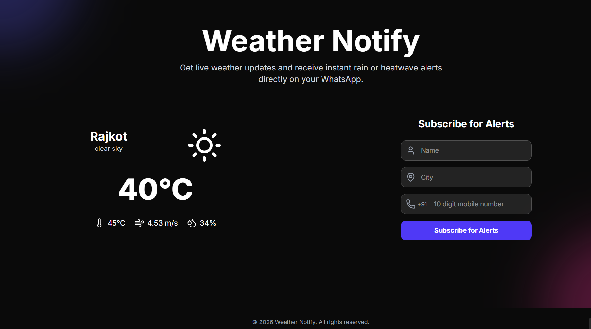

# Weather Notify

A Next.js web application that displays live weather data, provides an interactive 5-layer weather map with real RainViewer Doppler radar animation, lets users subscribe with their WhatsApp number, and sends automated daily weather alerts.



---

## Key Features

- **Live Weather Dashboard** — Auto-detects user location via geolocation with clear weather insights, air quality metrics (`µg/m³`), atmospheric conditions, and sun & UV recommendations.
- **Interactive Weather Map & Live Radar** — 5 dedicated weather layers at `/weather-map`:
  - **Radar** — Live Doppler precipitation radar from RainViewer with 1-second client-side animation, range slider scrubbing, local timezone frame timestamps, and 10-minute auto-refresh.
  - **Precipitation** — Global rainfall intensity & forecast distribution from OpenWeather.
  - **Temperature** — Thermal heat map overlay.
  - **Clouds** — Satellite cloud cover density.
  - **Wind Speed** — Surface wind velocity overlay.
- **WhatsApp Subscription & Automated Alerts** — Users subscribe with their name, city, and WhatsApp number. Vercel Cron automatically dispatches daily weather alerts at 6 AM IST with prioritized weather advisory tips.
- **WhatsApp Bot Commands** — Subscribers can text `WEATHER`, `WEATHER <city>`, `UPDATE`, or `STOP` directly to the WhatsApp bot.
- **Dynamic State Resolution** — Resolves location state names dynamically via OpenWeather Geocoding API (e.g. `Bhopal, Madhya Pradesh`, `Rajkot, Gujarat`).
- **Admin Dashboard** — Secured with JWT token authentication:
  - **Subscribers Management** — Search, filter, add, edit, or delete subscribers.
  - **Contact Messages & Email Reply** — View contact form submissions, reply via custom HTML emails (SMTP), and automatically deactivate answered messages (`Replied` badge).
  - **Broadcast System** — Broadcast custom WhatsApp alerts to all subscribers or specific city subscribers.
  - **Password Recovery** — Secure admin password reset workflow via email tokens.
- **SEO & Performance** — Site verification meta tags, automated sitemap at `/sitemap.xml`, and dynamic metadata.

---

## Tech Stack

| Layer | Technology |
|---|---|
| Framework | Next.js 16 (App Router) |
| UI | React 19, Tailwind CSS 4, Lucide Icons |
| Maps | Leaflet, React-Leaflet, CartoDB Voyager |
| Radar & Weather APIs | RainViewer Weather API, OpenWeather Maps API |
| Database | MongoDB (Mongoose) |
| Messaging | Twilio WhatsApp API |
| Email (SMTP) | Nodemailer |
| Authentication | JWT (JSON Web Tokens) & Cookies |
| HTTP Client | Axios |
| Hosting & Cron | Vercel (Cron Schedule at 6 AM IST) |

---

## Getting Started

### 1. Clone and install

```bash
git clone https://github.com/mr-baraiya/weather-notify.git
cd weather-notify
npm install
```

### 2. Set up environment variables

Copy `.env.example` to `.env` and fill in your keys:

```bash
cp .env.example .env
```

### 3. Run locally

```bash
npm run dev
```

Open [http://localhost:3000](http://localhost:3000).

---

## Environment Variables

| Variable | Description |
|---|---|
| `MONGODB_URI` | MongoDB Atlas connection string |
| `OPENWEATHER_API_KEY` | From [openweathermap.org](https://openweathermap.org/api) |
| `TWILIO_ACCOUNT_SID` | From Twilio Console |
| `TWILIO_AUTH_TOKEN` | From Twilio Console |
| `TWILIO_WHATSAPP_NUMBER` | Your Twilio WhatsApp sandbox/production number (e.g. `whatsapp:+14155238886`) |
| `TWILIO_WHATSAPP_JOIN_MESSAGE` | Sandbox join keyword (e.g. `join stand-exclaimed`) |
| `TWILIO_WHATSAPP_SANDBOX_NUMBER` | Sandbox phone number shown to users (e.g. `+1 415 523 8886`) |
| `ADMIN_WHATSAPP_NUMBER` | Personal WhatsApp number for admin notifications |
| `CRON_SECRET` | Secret key securing automated `/api/send-alert` cron execution |
| `JWT_SECRET` | Secret key for signing admin authentication tokens |
| `SMTP_HOST` | SMTP server host (e.g. `smtp.gmail.com`) |
| `SMTP_PORT` | SMTP server port (`587` for STARTTLS) |
| `SMTP_USER` | SMTP username/email address |
| `SMTP_PASS` | SMTP password or Google App Password |
| `SMTP_FROM` | Sender email address for outgoing support responses |
| `NEXT_PUBLIC_APP_URL` | Base URL of application (e.g. `http://localhost:3000` or production URL) |

---

## Admin Dashboard

Access `/dashboard` — sign in with your `ADMIN_PASSWORD`.

- **Analytics Overview** — Total subscribers, active cities, contact messages, and message response rates.
- **Subscribers Tab** — Full CRUD management for subscriber accounts with city filtering and search.
- **Contact Messages Tab** — Interactive prompt modal to reply directly to user inquiries via email. Answered messages automatically display a green **Replied** badge and disable duplicate actions.
- **Broadcast Tab** — Send instant WhatsApp alerts to targeted subscribers.

---

## Automated Daily Alerts (Vercel Cron)

Scheduled via `vercel.json` at `00:30 UTC` = **6:00 AM IST** daily:

```json
{
  "crons": [
    { "path": "/api/send-alert", "schedule": "30 0 * * *" }
  ]
}
```

---

## WhatsApp Bot Commands

| Command | Action |
|---|---|
| `WEATHER` | Weather for subscriber's saved city |
| `WEATHER <city>` | Weather for any specified city |
| `UPDATE <name> \| <city>` | Update name and city together |
| `UPDATE NAME <name>` | Update subscriber name |
| `UPDATE CITY <city>` | Update subscriber city |
| `STOP` | Unsubscribe and remove number |

---

## License

MIT

